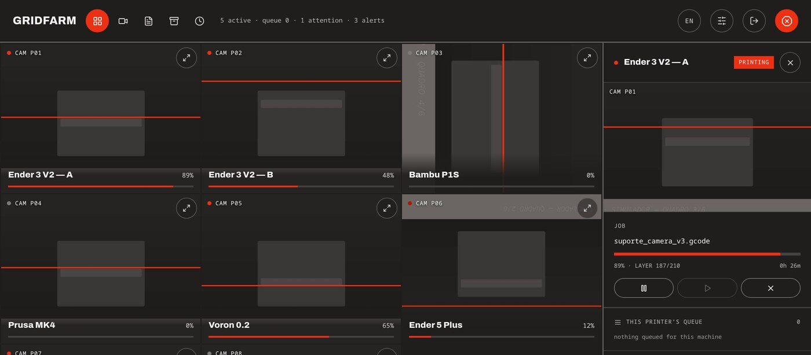
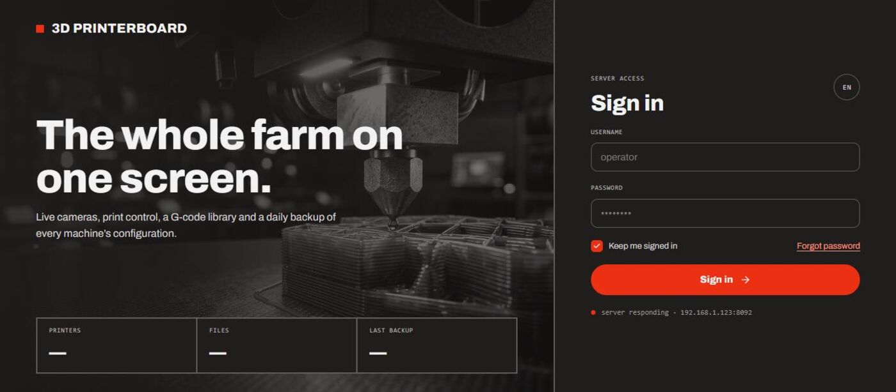
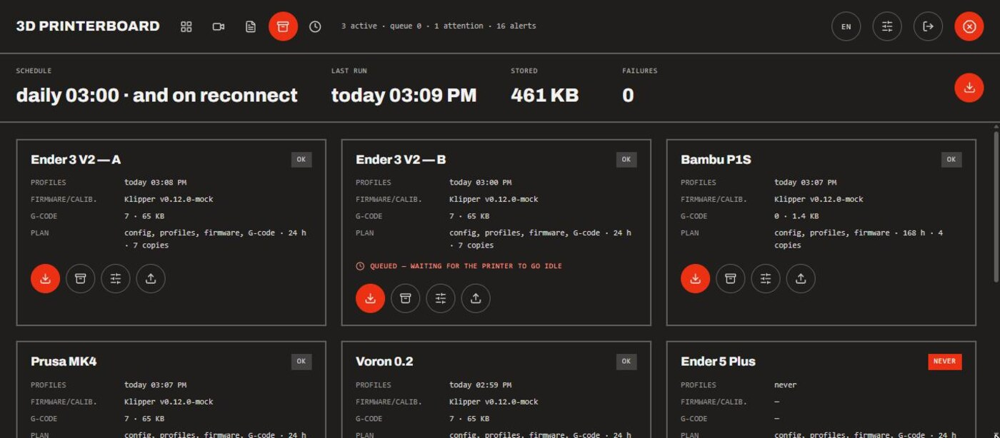
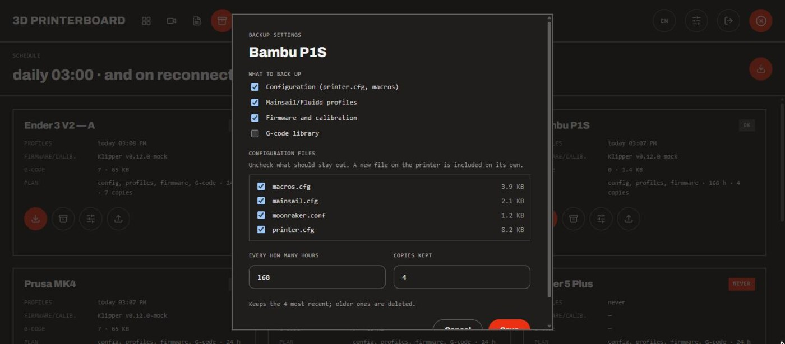

# GridFarm

Run your 3D print farm from one screen — remotely, from your own server.
Live cameras, print control, a G-code library with a queue, alerts, and the
thing Moonraker does not do: **automatic backups of every machine's
configuration** — on each machine's own schedule, and downloadable as a zip.

Built for people who own several Klipper/Moonraker printers and are tired of
keeping one browser tab open per machine.

Scope, plainly: it is aimed at **small and medium farms** — a handful of
machines up to a few dozen, all on the same LAN. Nothing here assumes a
datacentre: no clustering, no multiple sites, no tenants.

And it is a **personal project**, built at home for a farm of my own and shared
as it is. There is no company behind it, and it grows at the pace of spare time.

Everything runs in a single container: the same process serves the API and the
web app, and holds a persistent WebSocket to each Moonraker host.



<details>
<summary>More screens</summary>







</details>

## What you need

- **A machine to host it**: anything that runs Docker on the same LAN as the
  printers — a mini PC, a NAS, a spare Raspberry Pi. It does not go on the
  printers themselves.
- **Klipper + Moonraker** on each printer, reachable over HTTP. That is the only
  supported firmware: the app speaks Moonraker's API, not OctoPrint's or a
  vendor cloud.
- **A camera per printer, optionally** — MJPEG or a JPEG snapshot endpoint, which
  is what crowsnest, ustreamer and mjpg-streamer all serve.

## Getting started

The only thing you need beforehand is **Docker** on the host machine. On
Debian or Ubuntu that is `curl -fsSL https://get.docker.com | sh`; on a NAS it
is usually one click in the admin UI; on a Raspberry Pi with Raspberry Pi OS,
the same script as Debian. Everything below is copy-paste.

**1. Get the code.**

```bash
git clone https://github.com/DarkTiengo/gridfarm.git
cd gridfarm
```

**2. Make your own settings file.**

```bash
cp .env.example .env
```

**3. Fill in three things.** Open `.env` in any editor — `nano .env` if you have
no preference — and set:

| Line | What goes there |
| --- | --- |
| `ADMIN_PASSWORD=` | a password of your own, 8 characters or more. The server refuses to start while it is still the example value |
| `JWT_SECRET=` | run `openssl rand -hex 32` and **paste the output here**. It is what signs your session cookie; leave it empty and every restart signs you out |
| `PUID=` / `PGID=` | what `id -u` and `id -g` print. On most Linux desktops both are already `1000`, which is the default — on a NAS they usually are not |

**4. Create the data folder and start it.**

```bash
mkdir -p data
docker compose up --build -d
```

The first run builds the image and takes a few minutes. After that, starting is
seconds.

**5. Open it.** On the machine itself, `http://localhost:8080`. From a laptop or
phone on the same network, use the host's own address instead —
`http://192.168.1.50:8080`, or `http://nas.local:8080`. Sign in with the
`ADMIN_USER` and `ADMIN_PASSWORD` you just set.

That first admin exists only because the database was empty; from then on the
password lives in the app, and editing `.env` has no effect on it.

### Day to day

```bash
docker compose logs -f      # what it is doing, live
docker compose restart      # after changing .env — it is only read at startup
docker compose down         # stop; your data folder stays untouched
git pull && docker compose up --build -d    # update to a newer version
```

Everything that matters is in `data/`: the database, the backups, the alert
frames. Copy that folder and you have copied the installation.

### One setting worth not changing

Keep `NETWORK_MODE=host`. The container needs to see your LAN directly:
multicast does not cross Docker's default bridge, and without it `.local`
addresses and camera discovery stop working.

### Try it without hardware

```bash
MOCK_PRINTERS=true docker compose up
```

Brings up eight simulated printers in different states (printing, idle, paused,
attention) with synthetic cameras, files and working backups. You can walk
through all seven screens before registering a single real machine.

One thing to know before you run it: **on an empty database it writes those
eight fake printers in**, and they stay after you switch the flag back off — you
would have to delete them by hand in Settings. It leaves a database that already
has printers alone, so this only bites on a fresh install. If you want to try it
and leave no trace, move `data/` aside first and move it back afterwards.

## Adding your printers

Settings button in the top bar (admin only) → **+**. For each machine:

| Field | Example |
| --- | --- |
| Moonraker URL | `http://ender-a.local:7125` |
| API key | leave blank unless Moonraker requires one |
| Camera URL | `http://ender-a.local/webcam/?action=stream` |

**Test connection** sits right under the URL field, and runs on its own as soon
as you leave that field. It checks the printer, and then **finds the camera for
you**: it asks Moonraker which webcams it has configured (`/server/webcams/list`,
which is where Mainsail and Fluidd store them), falls back to the conventional
crowsnest paths, fills the camera field in, and shows **a real frame** so you can
confirm the angle and that it is the machine you think it is — before saving.

### .local addresses (mDNS)

`.local` names work out of the box. Worth knowing why that took effort: the
image runs on Alpine, whose musl libc has no NSS and therefore ignores mDNS
entirely — `ender-a.local` would never resolve, not even with host networking.
Instead of switching the base image or mounting an Avahi socket from the host,
the server speaks multicast DNS itself (`src/lib/mdns.ts`), caches answers by
their TTL, and falls back to regular DNS. It needs `NETWORK_MODE=host` to reach
the multicast group.

## The screens

**Dashboard** — camera wall plus a control panel for the selected printer: job,
**that printer's queue**, temperatures, jog and macros. With nothing selected,
the column shows the farm-wide queue.
The temperature section lists **every sensor the machine actually has**, not
just nozzle and bed: a heated chamber, a temperature-controlled fan, the MCU and
the Raspberry Pi. They are discovered from the printer at connect time
(`heater_generic`, `temperature_fan`, `temperature_sensor` and any extra
extruder), so a sensor you add to `printer.cfg` shows up after a restart without
touching this app. Anything that heats gets an **editable target** next to the
reading — bounded by the `min_temp`/`max_temp` of your own config — plus one
button that turns every heater off. What only measures shows the reading and
nothing else.
On a machine running `[exclude_object]`, and only while the slicer labelled the
objects, the job controls gain a fourth button: it opens **a map of the plate**.
Every object is drawn where it actually sits, the one being printed right now is
marked, the ones already dropped are struck out, and clicking any of them takes
it out of the print while the rest of the plate carries on — which beats losing
a full plate to one part that lifted. The map is fetched only when you open it:
the live snapshot carries the current object's name and nothing else, because
the plate geometry is heavier than the whole snapshot and never changes mid-print.
The name that goes back into the G-code is always the one the printer reported,
matched against its own list — never a string from the browser.
Below the jog pad there is an **extruder control**: push or pull 1, 5, 10 or
50 mm of filament, at 1, 2, 5 or 10 mm/s. It refuses in the three cases where it
would do damage instead of work — mid-print (a `G1 E` from the panel lands in
the middle of the file and ruins the part; pause first, which is when you change
filament anyway), below the `min_extrude_temp` read from your own config, and
with Klipper not ready. Each of those is a greyed-out button with the reason
written under it, not an error after the click.
Next to it, **load and unload filament** call your machine's own
`LOAD_FILAMENT` / `UNLOAD_FILAMENT` macro (`FILAMENT_LOAD` / `FILAMENT_UNLOAD`
also recognised), because bowden length, pre-heating and tip forming live in
your `printer.cfg` and cannot be guessed from here — 80 mm that loads a direct
drive does nothing on a 450 mm bowden. A machine without the macro shows the
button greyed out saying which one is missing, rather than inventing a length.
Those two are dropped from the macro grid below, so they don't take two of its
eight slots twice over.
The same heaters also get a **graph**: ten minutes of curves, the reading solid
and the target dashed in the same colour. It answers what a column of numbers
cannot — is it still climbing, did it settle, did it fall on its own. The past
comes from Moonraker's own `server.temperature_store`, which already keeps a
point per second per sensor, so nothing is recorded here for the graph to
exist and restarting this app loses no history; it is fetched once when you
open the section and from then on the curve advances with the values the live
snapshot already carries. Only things that heat are drawn: the MCU sitting at
40 °C on the same axis as a 250 °C nozzle would flatten the two curves you came
to look at.
Below the macros there is a **console**: what the machine says, and what you say
to it. The lines are Klipper's own `gcode_response` — the same source Mainsail's
console shows — coloured by what Klipper marked them as, with its `!!` errors
pulled out in red, which is what you are looking for when you open a console at
all. It reads back **with the printer offline**, on purpose: the last thing a
machine said is usually the explanation for it going quiet, and needing it
online to read that would hide the diagnosis exactly when you need it. Typing a
command needs the same permission as any other control, and what you type — plus
any macro you click — is echoed above the answer, so the console reads as a
conversation. The jog pad, the extruder and the temperature targets deliberately
stay out of it: they are gestures repeated dozens of times in a row, and the
`SAVE_GCODE_STATE` behind every arrow click would drown what you opened it for.
Neither the console nor the graph rides in the live snapshot — that object is
republished whole on every field change, so a log inside it would be re-sent
four times a second forever. The console is its own stream event, which costs
nothing while a machine is quiet, and the graph is fetched on demand (~6 KB for
a machine with four heaters). Both sections fold away from their own header, and
folded they also stop fetching.
**Cameras** — 2×2 quadrant with controls and a thumbnail strip. A camera bolted
on sideways can be **rotated per printer** — 90°, 180° or 270°, set in Settings
and shown in the preview before you save. The turn happens in the browser as it
draws, so it costs nothing and no frame is re-encoded; the flip side is that it
applies where this app draws — the JPEG stored with an alert, and the one sent
to Telegram, stay as the camera sent them.
**Files** — G-code library **grouped by printer**, so it is obvious which machine
already holds a file and which one will print it. Queueing from a group sends
the job to that group's printer; the selector at the top can override this to
"next free" or to one specific machine.
**Backups** — per-machine state, manual runs, per-machine settings (what to
copy, how often, how many copies to keep), download of any stored copy, and
restore.
**Alerts** — list by severity, with the camera frame captured at that moment.
Those frames are deleted after `ALERT_FRAME_KEEP_DAYS` (14 by default); the alert
itself stays in the history, just without the picture.
Critical ones are pulled to the top and marked out by more than colour: a red
bar down the side of the row, a `CRITICAL` tag, a banner on the detail pane, and
a counter in the top bar that jumps straight to the list from any screen.
**A printer that was switched off is not a printer that vanished.** From the
outside both look the same — the socket drops and never comes back — so the
difference is whether anyone asked for it. Shutting down or rebooting from this
app marks the absence before the command is even sent (the host often dies
mid-call, and the answer arrives after the socket is already gone); a shutdown
done elsewhere — Mainsail, `sudo poweroff`, the switch on the machine — is read
from the WebSocket close code, because a host on its way down says goodbye and a
yanked cable does not. Either way the card reads `POWERED OFF` instead of
`OFFLINE`, the alert is a low-severity note that stays out of the default
Telegram set, and the camera going quiet on the same host stops being news of
its own. What still alerts, exactly as before: a machine that disappears with no
explanation, and a reboot that has not come back after five minutes.
And because a `poweroff` stops Klipper a moment before it stops Moonraker, the
"Klipper halted" alert waits ten seconds and re-reads the machine before firing:
if the whole host went away in the meantime it was a shutdown, not a crash. A
Klipper that really died leaves the host up, and the alert goes out as always.
**Settings** — printer CRUD.

### Getting told about it

Alerts also go out over **Telegram**, which is the point of them existing: an
alert nobody sees is a printer that spent the night broken. Critical ones arrive
with the camera frame from the moment it happened, and the Klipper reason
verbatim.

Set it up under Settings → Notifications: the bot token from @BotFather and a
chat id (message your bot, then read `chat.id` from
`https://api.telegram.org/bot<TOKEN>/getUpdates`; a group starts with `-100`).
The token never leaves the server — the screen only ever sees `••••`. A **Send a
test** button tells you immediately whether it works, quoting Telegram's own
refusal when it does not, and the last failure stays visible on the card until a
send succeeds.

You pick what is worth a phone buzzing, per alert type. Out of the box that is
the problems plus the end of a print; camera hiccups and backup housekeeping
stay quiet. When an alert clears itself — Klipper back up, printer back on the
network — a ✅ follows, but only for alerts you were told about in the first
place.

Messages go out in Portuguese: that is the language the server writes alert text
in, and translating them would mean moving those sentences out of the server.

You can also **ask** the bot, rather than only being told:

- `/status` — one line per machine: what it is doing, how far along, how long is
  left.
- `/status P05`, or `/status voron` — one machine in detail, with a **live**
  camera photo taken right then. Partial names work; an ambiguous one gets you
  the list to pick from.
- `/ajuda` — the same list, in the chat.

Two boundaries worth stating. Only the chat you configured is answered — anyone
can find a bot by name, and even replying "not allowed" would confirm to a
stranger that there is a farm behind it, so everything else is ignored in
silence. And it is **read-only**: a Telegram chat is not an authenticated
session, so pausing or cancelling a print still means opening the app, where
there is a user, a role, and a record of who did it.

This works over long polling, not webhooks — nothing needs to be reachable from
the internet, which is the same reason it keeps working on a LAN-only install.
Commands that arrive while the server is restarting are dropped rather than
replayed: `/status` asks about now, and answering one from six hours ago would
only confuse.

Browser push notifications are **not** available, and cannot be: service workers
and the notification API only exist over HTTPS, and this app is built to be
reached over `http://` on the LAN. Telegram has no such constraint, works with
the app closed, and reaches a phone that is not even on the same network.

### Powering a printer down

The panel's last section, **Machine**, reboots or shuts down the *host* — the Pi
running Klipper and Moonraker — not the firmware. Both go through Moonraker
rather than Klipper, so they still answer when Klipper itself has halted, which
is exactly when a reboot is what you want. Each asks for confirmation first, and
says out loud that a print in progress will be lost.

Reboot is available to operators: it undoes itself, the machine is back in about
a minute, and it is the way out of a wedged Klipper. Shutdown is admin-only —
nothing brings the machine back but someone standing next to it. If Moonraker
refuses (it does when it runs inside a container, or without sudo rights), the
refusal is shown as it came, rather than a hopeful "shutting down".

### What raises an alert

The serious class is **Klipper halted** — an MCU that stopped answering, thermal
runaway, a broken config, or the Klipper process dying under a Moonraker that is
still up. The alert carries Klipper's own reason verbatim (`MCU 'mcu' shutdown:
Lost communication with MCU 'mcu'`), untranslated, because that is the string you
will paste into a search or a forum. It clears itself once the machine is ready
again, normally after a `FIRMWARE_RESTART`.

The rest: a printer that stops answering (critical if it was mid-print, since
that print carries on unwatched — it clears itself on reconnect), a print
aborted with the firmware still healthy, filament running out, a camera that
went dark, and the backup alerts described further down.

### Watching for spaghetti

Off by default, and worth turning on: the server can **look at the cameras
itself** and stop a print that has come off the bed. Getting it running is five
steps, written out at the end of this section.

It is not a camera stream being analysed frame by frame. **One frame every 25
seconds per printer, and only from printers that are actually printing** — and
even then it costs nothing extra when someone has the camera wall open, because
the frame comes from the cache that wall already fills. On top of that, only one
analysis ever runs at a time in the whole farm, so the CPU peak is that of *one*
inference, not eight.

One frame costs **26 ms** on two threads, or 45 ms on one — measured inside the
container, on the same Alpine image that ships. That is a desktop; a Raspberry
Pi 4 will be several times slower, so budget a few hundred milliseconds. Either
way, at one frame per machine per 25 seconds, eight printers add up to a couple
of percent of one core. The model is unloaded from memory after ten minutes with
nothing to watch, which is the only part that costs anything while the farm
sleeps: about 100 MB while it is loaded.

**Nothing acts on one frame.** A nozzle crossing the lens, a blurry frame in the
middle of a fast move, the light changing when someone walks into the workshop —
each of those gets a high score from a classifier trained on clean photos. So the
evidence has to be continuous: **three suspicious frames in a row**, about 75
seconds, and any clean frame in between resets the count to zero. The first two
minutes of a print are skipped as well, because the purge line and the skirt are
exactly what the model was trained to call a tangle.

On confirmation, per printer, one of three: **alert only**, **pause** (the
default) or **cancel**. Pause is the default because it is the one that survives
being wrong in both directions — a false positive costs you a click to resume, a
real one gets the nozzle off the tangle without throwing away a print that might
still be saved. The alert carries **the frame that convinced it**, not one taken
afterwards: by then the print is paused and the toolhead is parked somewhere
else, and the picture would explain less than the one that made the decision.
It reaches Telegram with that photo, like any other alert. It acts **once per
print** — resume after looking at the photo and it will not argue with you.

The model is not in this repository and not in the image. It is fetched once
into `<DATA_DIR>/modelos/`, checked against `DETECCAO_MODELO_SHA256`, and stays
on the volume; an install with no internet can drop the `.onnx` in that folder
by hand instead. Inference runs in WebAssembly inside the same process — the
image is Alpine, so musl, and `onnxruntime-node` publishes no musl build. Same
runtime, ~2× the time per frame, no new native dependency, and it behaves
identically on x64 and arm64.

Worth being straight about what it is:

- It sees **spaghetti** — the print that let go and became a tangle. It does not
  see under-extrusion, a layer shift, warping or a clogged nozzle.
- It cannot see what the camera cannot see. A lens out of focus, the light off
  inside an enclosure, a camera aimed at the back of the machine: no detection,
  and no warning that there is no detection.
- **It is not a safety device.** Thermal runaway is Klipper's job and stays
  Klipper's job.
- It will be wrong in both directions. That is the whole reason pause is the
  default rather than cancel.

#### Turning it on, step by step

Only the first step is any work, and it is done once. Nothing here needs a GPU.

**1. Build the model file.** The detector needs a trained model, and it is not
in this repository: it is 10 MB, it only matters to people who switch this on,
and its licence is not this project's to redistribute. You build it yourself
from a public one, on **any computer with Python** — your laptop is fine, it
does not have to be the machine running GridFarm.

```bash
python3 -m venv /tmp/yolo-export
cd /tmp/yolo-export

# the CPU index on purpose: the default torch drags in ~3 GB of CUDA libraries
# you do not need to convert a model
./bin/pip install torch --index-url https://download.pytorch.org/whl/cpu
./bin/pip install ultralytics huggingface_hub

cat > export.py <<'PY'
import pathlib, shutil
from huggingface_hub import hf_hub_download
from ultralytics import YOLO

baixado = hf_hub_download("ApatheticWithoutTheA/3D-Print-Failure-Detector",
                          "yolov11-3d-print-failure-detection")

# the file on Hugging Face has no extension, and Ultralytics picks the format
# from the suffix
pt = pathlib.Path("falhas.pt")
shutil.copy(baixado, pt)

m = YOLO(str(pt))
print("CLASSES:", m.names)
print("WROTE:", m.export(format="onnx", imgsz=320, simplify=True, opset=12))
PY

./bin/python export.py
```

Two things in that output matter. **`imgsz=320` is not optional** — the server
feeds the model 320×320 and a model exported at any other size will refuse to
run. And `CLASSES:` tells you which number `spaghetti` is; with the model above
it is `0`, which is the default, so you can ignore it. If yours says anything
else, put that number in `DETECCAO_CLASSE`.

**2. Put the file where the server looks.**

```bash
mv falhas.onnx falhas-v1.onnx
mkdir -p /path/to/gridfarm/data/modelos
cp falhas-v1.onnx /path/to/gridfarm/data/modelos/
```

The name has to be exactly **`falhas-v1.onnx`**. Not `falhas.onnx`, and watch
the double `n` — a typo here is not an error message, it is a server that says
the model is missing and never looks at anything. The folder lives on the data
volume, so it survives rebuilds.

**3. One line in `.env`.**

```bash
DETECCAO_ENABLED=true
```

Everything else has a working default: a frame every 25 s, three suspicious ones
in a row before acting, pause as the action. `.env` is read at startup only, so
editing it while the container runs changes nothing.

**4. Restart.**

```bash
docker compose up -d
```

**5. Tick the machines.** Settings (top bar, admin only) → **Failure detection**,
at the bottom of the page. The card should say the model is **ready**, with its
size. Then **Edit**, tick the printers you want watched, choose what each one
does on confirmation, and save. A printer with no camera is shown greyed out
with the reason — register its camera first.

#### Did it work?

The container log says so at startup:

```
detecção de falha ativa: um quadro a cada 25 s por máquina, 3 suspeitas seguidas para agir
```

After that, **expect silence**. Nothing is analysed until a watched printer has
been printing for more than two minutes, and a healthy print produces no log
lines at all. Silence is the normal state.

If you want to see the whole thing happen without waiting for a real failure,
bring the farm up simulated and force the score:

```bash
MOCK_PRINTERS=true DETECCAO_ENABLED=true DETECCAO_SIMULAR_CONF=0.93 \
DETECCAO_INTERVALO_S=2 DETECCAO_ESPERA_INICIAL_S=0 docker compose up
```

`DETECCAO_SIMULAR_CONF` overrides what the model would have said, so this works
even before step 1. Switch on detection for one of the eight fake printers and
within a minute you get the alert, the photo, and the machine paused. Take the
variable back out afterwards — left in, every frame is a failure.

#### When nothing happens

This feature fails quietly by design — it would rather do nothing than stop a
print by mistake — so the usual symptom is no symptom. In order of how often
each one is the answer:

| What you see | What it usually is |
| --- | --- |
| Card says the model is missing | The filename. It must be `falhas-v1.onnx`, in `data/modelos/` |
| Card is greyed out entirely | `DETECCAO_ENABLED` is not `true`, or the container was not restarted after the edit |
| Model loads, nothing is ever flagged | The class index. Check `CLASSES:` from step 1 against `DETECCAO_CLASSE` |
| A machine is ticked but never analysed | It has to be **printing**. Powered on and idle is not enough |
| Printer greyed out in the list | No camera registered for it |
| Errors in the log about the input shape | The model was exported at something other than `imgsz=320` |

## Language

The interface ships in **English, Brazilian Portuguese, Spanish, French and
Italian**. The picker sits in the top bar and on the sign-in screen; the choice
is remembered per browser, and the first visit follows your browser's language
list. Dates, numbers, clock format and relative times follow the selected
locale.

Adding a language is one file: copy `apps/web/src/i18n/en.ts`, translate the
values, and register it in `apps/web/src/i18n/index.ts`. The dictionary is typed
against the Portuguese one, so the compiler tells you if a key is missing.

## Nothing starts on its own

A queued job waits for someone to authorise it. When a printer is idle, its
panel shows what is next and a button starts it — one click, naming the file.

That is deliberate. When a print finishes, **the part is still on the bed**, and
the machine has no way of knowing whether anyone took it off. A farm that starts
the next job automatically eventually prints into the previous part and ruins
both.

If you would rather have it unattended, `QUEUE_AUTO_START=true` restores the old
behaviour: the queue dispatches to any idle printer by itself.

### Reprinting

When a print finishes **whole**, the printer's panel offers to run it again.
The offer only appears after a real completion — after a cancel or an error,
repeating the same thing blindly would just waste filament. It reads Klipper's
own `print_stats.state`, so it also covers prints you started from Mainsail.

## Roles

| | read-only | operator | admin |
| --- | --- | --- | --- |
| See everything | ✓ | ✓ | ✓ |
| Pause/resume/cancel, emergency stop, queue | | ✓ | ✓ |
| Run a backup, download a stored copy | | ✓ | ✓ |
| Restore a backup, change a printer's backup settings, manage printers and users | | | ✓ |

Enforced on the server. The front end only mirrors it by disabling buttons.

## Backups

Runs daily at 03:00 (`BACKUP_CRON`) over Moonraker's HTTP API only — no SSH, no
operating-system credentials. It covers the three lines on each card:

- **profiles** — `printer.cfg`, macros and the rest of the `config` root, plus a
  dump of Moonraker's database (Mainsail/Fluidd slicing profiles)
- **firmware/calibration** — `machine.system_info` and `machine.update.status`
- **G-code** — the `gcodes` root

Each run becomes `data/backups/<printer>/<timestamp>.zip` with a
`manifest.json` beside it. The content goes into a content-addressed store under
`data/blobs/`: eight machines print largely the same files, and the `printer.cfg`
that has not changed in a month is one blob, not thirty — without deduplication a
7-day retention would fill the disk. Archives written before this change are
`.tar.gz`; they still restore and still download, as they are.

### Per printer: what, how often, how many

Every card has a settings button. Per machine you choose:

- **what to copy** — the four sections above, plus a checklist of the individual
  configuration files, read live from the printer. It is an exclusion list: a new
  file that appears on the machine is included on its own, instead of staying out
  until somebody remembers to tick it.
- **how often** — its own interval in hours. The nightly cycle skips a machine
  that is still within its interval, so a printer set to weekly is not copied
  every night. The manual button copies regardless.
- **how many copies to keep** — the older ones are deleted, archive and all.
  Lowering the number applies immediately.

Blank means "use the farm default" (`BACKUP_INTERVAL_HOURS`, `BACKUP_KEEP`).
Changing the settings needs the admin role, since a smaller retention deletes
copies right away.

### Download

The copies button lists what is stored, newest first, with a link to download
each one. The stored `.zip` carries the configuration, the database dump and the
system info; the G-code library is not repeated inside it, so a second link
rebuilds the archive on the fly with the G-code included when you want the whole
thing. Downloading requires the operator role — those files are the machine's
configuration.

### Idle printers only

**No backup ever runs on a machine that is working** — that holds for the
scheduled cycle, the manual button and catch-up alike. Pulling a gigabyte of
G-code off a Raspberry Pi mid-print competes with Klipper for CPU and network,
and the price is stutter in the print.

A busy printer is not refused, it is queued, and copied as soon as the print
ends. Idle means idle: paused, attention and offline all wait. The card shows
`QUEUED — WAITING FOR THE PRINTER TO GO IDLE`, and the manual button tells you
it will run later.

If a printer never opens an idle window, that does not stay silent: after two
intervals in the queue, a medium-severity alert says so.

### Catch-up on reconnect

The scheduled cycle only reaches machines that were on at the time, and in a
home farm they spend days switched off. So **every time a printer reappears on
the network the system checks its last backup**: if more than
`BACKUP_INTERVAL_HOURS` (24 by default) has passed, it joins the queue and is
copied once idle, with a low-severity alert recording that it had fallen behind.
It waits for Klipper to finish booting before asking anything.

When the whole farm powers up together, backups go out one at a time.

### Restore

Overwrites the configuration on the target printer — which may be a *different*
printer, the way you clone the machine that works. Admin role and an explicit
confirmation required.

## Cameras

One upstream connection per camera on the server, fanned out to every viewer —
the camera host sees a single connection, not one per open tab.

In the browser almost everything is **snapshot polling**, not MJPEG: HTTP/1.1
allows only 6 connections per origin, and one stream per tile would consume all
of them, leaving the event stream and the API itself queued behind. Only the
focused feed stays live (the control panel, or the first quadrant on the
Cameras screen).

## Security

The trust model is simple: **whoever signs in is trusted within their role, and
everything else is verified on the server.**

- Every route requires a session except sign-in. The role is read from the
  database on each request, not from the token — removing a user or demoting
  them takes effect immediately rather than whenever the JWT expires.
- Permissions are never decided in the browser. The front end disables buttons
  for convenience; the server is what actually refuses.
- Session in an `httpOnly` + `SameSite=Strict` cookie. The `Secure` flag is
  decided per connection (`COOKIE_SECURE=auto`): always setting it would break
  access over `http://` on a local network, which is how a farm is used.
- Security headers via helmet, with a CSP that allows no external and no inline
  scripts.
- Rate limits on the sensitive routes (sign-in, print control, G-code, emergency
  stop, restore, user creation). Deliberately not global: the camera wall does
  legitimate polling well above a thousand requests per minute.
- The Moonraker API key never leaves the server — the settings screen only ever
  sees `••••`.
- Restore validates every path in the manifest before reading a file.

Two capabilities that are powerful **on purpose**, and worth knowing about:

- `POST /api/printers/:id/gcode` runs arbitrary G-code on the machine. That is
  the point of the app (macros and console), and Moonraker exposes the same.
  This is why `operator` is already a trusted role.
- An admin registers the URLs the server fetches (Moonraker and cameras), so an
  admin can point the server at any address reachable on the network. That is
  inherent to the product; `admin` is the highest-trust role.

## Development

```bash
npm install
npm run build -w @gridfarm/shared          # everything else depends on its dist
MOCK_PRINTERS=true npm run dev:server    # API on :8080, data in ./data
npm run dev:web                          # Vite on :5173, proxying the API

npm test         # Vitest: normalizer, queue engine, backup schedule and packer,
                 # MJPEG demuxer, mDNS codec, formatters, failure detector
npm run typecheck
```

Outside Docker the server reads `DATA_DIR` (default `./data`) and `WEB_DIR`
(default `apps/web/dist`); the image sets both for you.

```
packages/shared   types shared by both sides
apps/server       Fastify, SQLite, Moonraker clients, backup, queue, alerts,
                  failure detection, mDNS
apps/web          React + Vite, screens and components
design/           the design package — README.md is the visual source of truth
```

`design/README.md` carries the final measurements, colours and states for every
screen; check it whenever you touch the UI.

Two things are still written in Brazilian Portuguese, and it is worth being
straight about it: the source comments and log lines, and the **prose inside
alert details** — the sentence explaining what happened. Alert *titles* are
translated (they carry a stable code the front end maps), and every other string
in the UI is too; only that description is still emitted by the server in the
language it was written in. The design package is in Portuguese as well.
